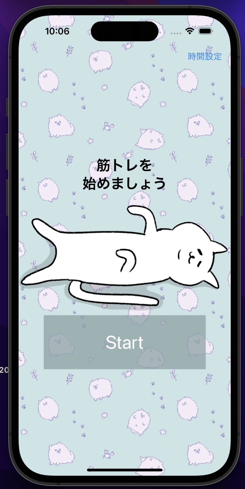
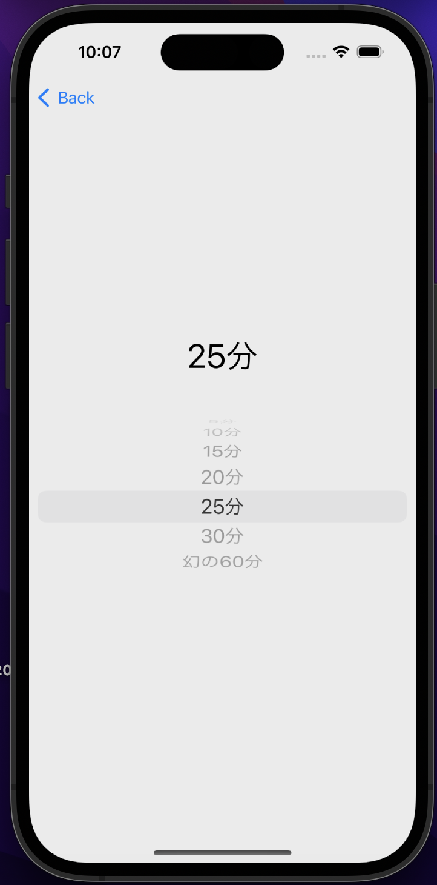
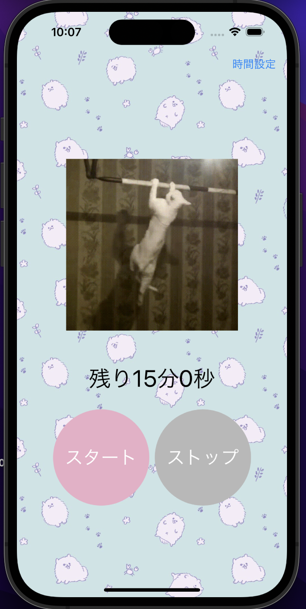
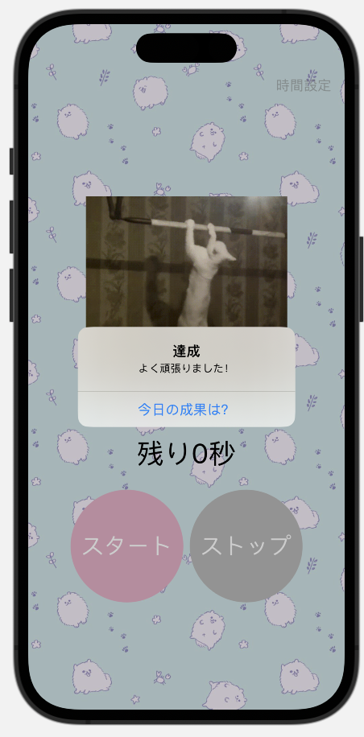
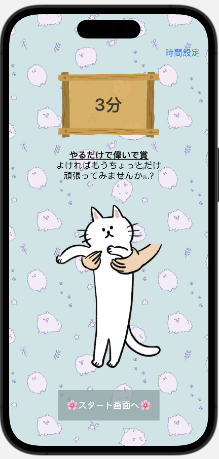

# kintoreApp

筋トレがあまりに続かない自分のために作ったアプリ

## 目次

- [使い方](#使い方)
- [技術情報](#技術情報)

## 使い方

1. アプリを開き、startボタンを押します。
2. 筋トレ時間の指定は右上から行います。
3. スタートでタイマーを開始します。
4. タイマーが０になると成果を見ることができます。達成画面は筋トレ時間によって変わります。  
    

## 技術情報
- 開発環境： Xcode
- 開発言語: Swift 5.8.1 
- Swiftドライババージョン: 1.75.2
- 対応OS: macOS 13.0

